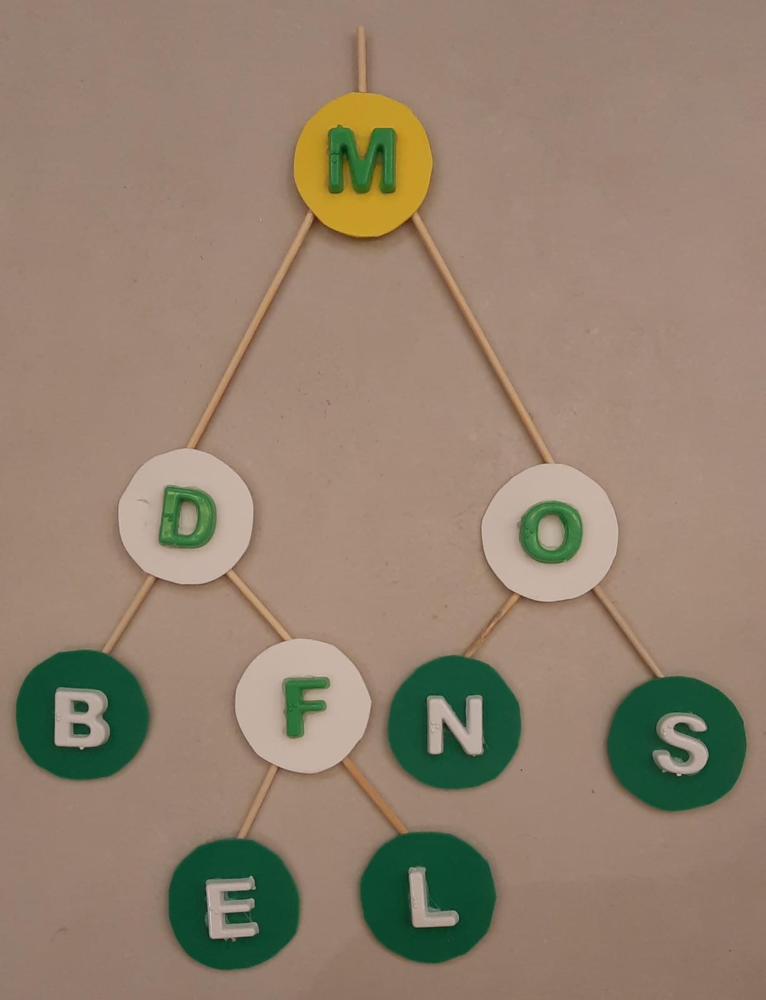
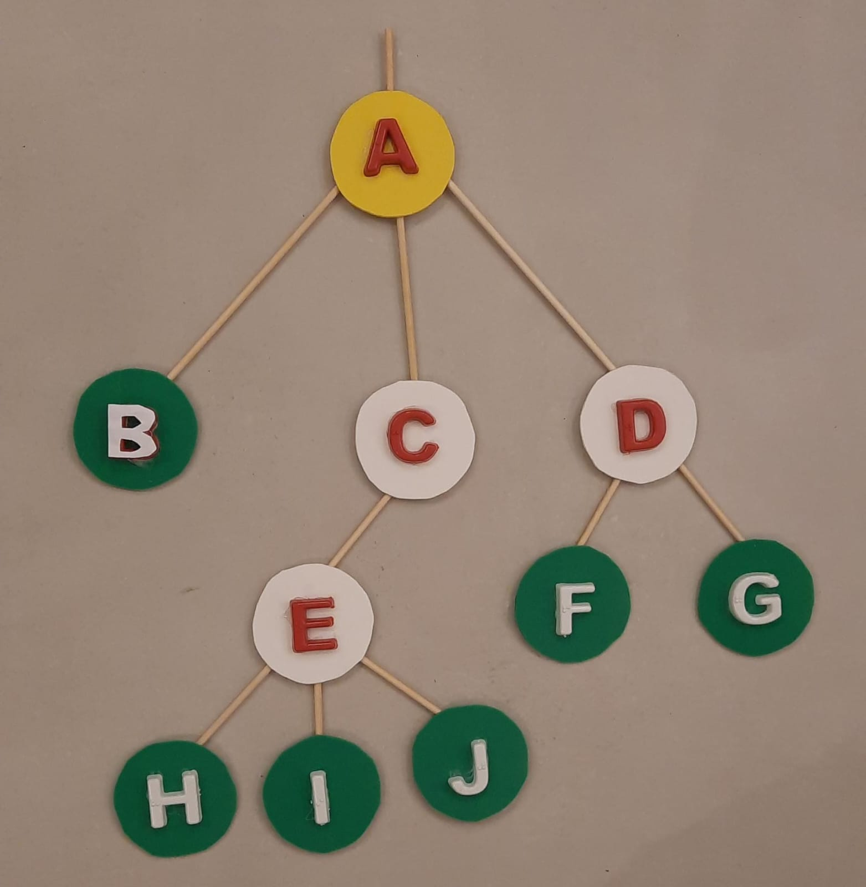
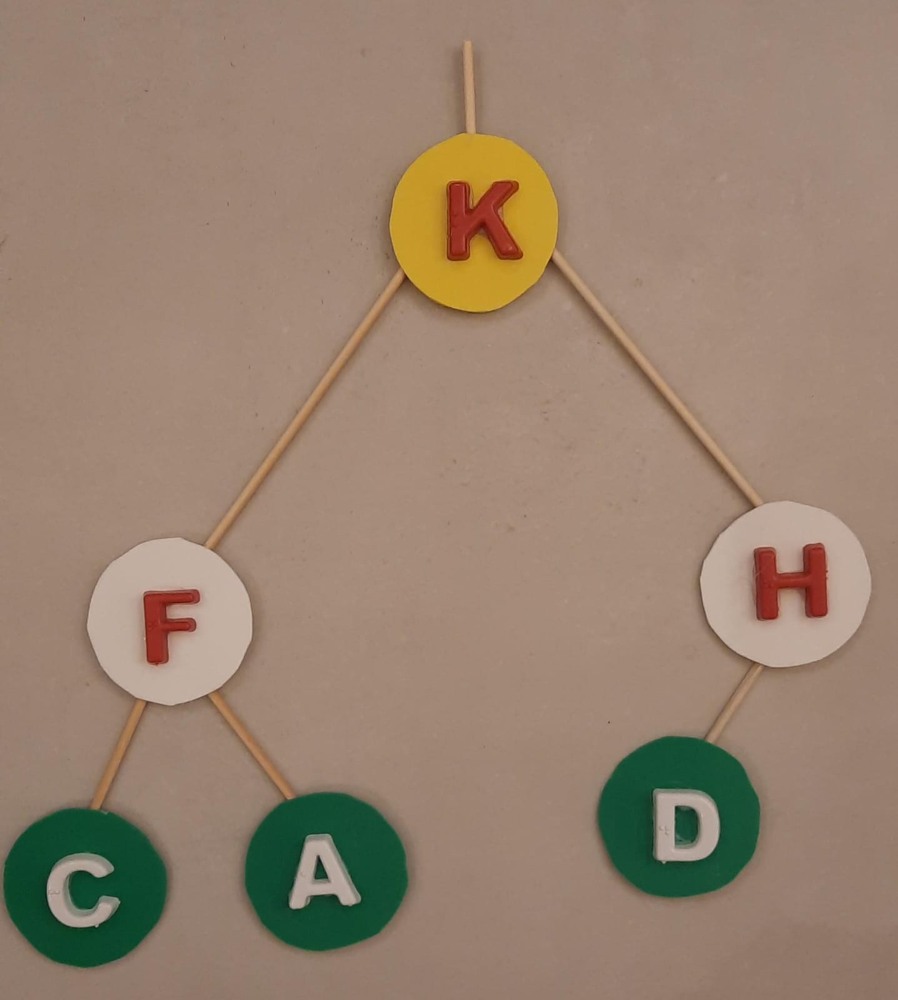

# Árvores de Busca

------

## Pré-Requisitos

São requisitos para essa aula:

- Introdução/Fundamentos de Programação (em alguma linguagem de programação)
- Interesse em aprender C/C++
- Noções de recursividade
- Noções de tipos de dados
- Noções de listas e encadeamento
- Aula de Árvores

*Agradecimentos especiais ao prof. Fabiano Oliveira e prof. Fábio Protti, cujo conteúdo didático forma a base desses slides*


# Árvores de Busca

------

## Problema de Busca

Consideramos o *Problema da Busca* em que, dados:

- Conjunto de chaves $S = \{s_1, ..., s_i, ..., s_n\}$, $s_1 < ... < s_n$
- Dado $x$ (do mesmo tipo dos elementos de $S$)

**Responda:** $x$ pertence a $S$?

Em caso positivo, encontrar $s_i$ tal que $s_i = x$.

**Desafio:** Como organizar os dados de forma a facilitar a operação de busca?

------

## Árvore Binária de Busca: Definição

Podemos utilizar uma Árvore Binária rotulada $T$, tal que:

- $T$ possui $N$ nós. Cada nó $v$ corresponde a uma chave distinta $s_i \in S$ e possui como rótulo o *valor* $r(v)=s_i$
- Sejam $v$, $v_1$, $v_2$ nós distintos de $T$, sendo $v_1$ pertencente à subárvore esquerda de $v$, e $v_2$ à subárvore direita de $v$, tais que: $r(v_1) < r(v)$ e $r(v_2) > r(v)$

{width=30%}

*$T$ é uma Árvore Binária de Busca (ABB)*


------

## Árvore Binária de Busca: Exemplo

Exemplos de ABB, contendo nós D, E, F, L, M, N e O.

::::::::::{.columns}

:::::{.column width=45%}

{height=40%}

:::::

:::::{.column  width=50%}

{height=40%}

:::::

::::::::::


------

## Estrutura de Árvore Binária

Relembrando (aula de Árvores) a estrutura de árvore binária considerada:

```.cpp
struct NoEnc3 {
   char chave;     // dado armazenado
   NoEnc3* esq;    // filho esquerdo
   NoEnc3* dir;    // filho direito
};

struct ArvoreEnc3 {
  NoEnc3* raiz;    // raiz da árvore
};
```

------

## Problema da Busca com uma ABB

Podemos resolver o *Problema da Busca*, com chave de busca $c$, através de uma ABB.

**Ideia Geral**: 

- Parta do nó raiz $v$
- Verifique se a chave de $v$ é $c$, ou seja, `v->chave == c`
- Em caso positivo, o algoritmo termina (chave encontrada)
- Caso contrário, verifique se:
   *  `c < v->chave`: refaça o algoritmo na subárvore esquerda
   *  `c > v->chave`: refaça o algoritmo na subárvore direita
- Caso o nó $v$ não exista, a busca termina.

{height=30%}

--------

## Tarefa

Avalie se as árvores abaixo são árvores binárias de busca:


::::::::::{.columns}

:::::{.column width=45%}

{height=40%}

:::::

:::::{.column  width=50%}

{height=40%}

:::::

::::::::::

. . .

**Solução:** nenhuma delas é! Erros: $B < A$ (na A1); $H > K$ (na A4).

--------

## Implementação: `buscaABB`

Implementação da busca em árvores binárias de busca:

```.cpp
auto* buscaABB(auto* no, char c) {
    if(!no) return no;             // chave não encontrada
    if(no->chave == c) return no;  // chave encontrada
    if(c < no->chave)
        return buscaABB(no->esq, c);  // recursão esquerda
    else
        return buscaABB(no->dir, c);  // recursão direita
}
```

**Pergunta:** *Quantos chamadas recursivas esse algoritmo pode precisar?*

. . .

**Resposta:** Em uma árvore degenerada com $N$ nós, até $N$ passos (observe que, nesse caso, $N$ também é a *altura da árvore*)

---------

## Exercício

Encontre o *pior caso* (pior *chave de busca*) para a execução do algoritmo `buscaABB` nas quatro árvores abaixo (avalie primeiro se são ou não árvores binárias de busca):

::::::::::{.columns}

:::::{.column width=70%}

{width=90%}

:::::

:::::{.column  width=30%}

{height=40%}

:::::

::::::::::

. . .

**Solução:** 1. N/A, 2. N/A, 3. D, 4. N/A, Fig.7 L

---------

## Árvore Binária de Busca Ótima

Como a `buscaABB` depende a altura da árvore, qual o melhor caso possível para a busca (menor altura possível) em uma árvore binária com $N$ nós?

Relembrando: uma árvore binária completa (ou cheia/perfeita) possui $\lceil \log_2 (N+1) \rceil$ níveis.

::::::::::{.columns}

:::::{.column width=70%}

{width=80%}

:::::

:::::{.column  width=30%}

{height=40%}

:::::

::::::::::

. . .

**Solução:** 1. N/A, 2. N/A, 3. Falso, 4. $N=7$ e $\log_2 8 = 3$ (Fig.7 tem $\log_2 9 = 4$)


# Operações Básicas em ABB (Exercícios Práticos)

## Exercício: Encontre o menor elemento uma ABB

Dado um nó do tipo `NoEnc5`, calcule o menor elemento da árvore, com método:

`NoEnc5* minimo(NoEnc5* const no)  { ... }`

:::::::: ||
::::: |{30%}

```.cpp
struct NoEnc5 {
   char chave; 
   NoEnc5* esq; 
   NoEnc5* dir;
   NoEnc5* pai; 
};
```

:::::

. . .

::::: |{55%}

```.cpp
NoEnc5* minimo(NoEnc5* const no) 
// pre(no)               // C++26
// post(out : !out->esq) // C++26
{
  auto* atual = no;
  while(atual->esq) atual = atual->esq;
  return atual;
};
```

:::::
::::::::


## Exercício: Encontre o sucessor de um elemento numa ABB

Dado um nó do tipo `NoEnc5`, calcule o elemento sucessor na árvore, com método:

`NoEnc5* sucessor(NoEnc5* const no)  { ... }`

:::::::: ||
::::: |{30%}

```.cpp
struct NoEnc5 {
   char chave; 
   NoEnc5* esq; 
   NoEnc5* dir;
   NoEnc5* pai; 
};
```

:::::

. . .

::::: |{55%}

```.cpp
NoEnc5* sucessor(NoEnc5* const no)   
// pre(no)  // C++26
// post(out : implica(no->dir, !out->esq)) 
{
    if(no->dir) return minimo(no->dir);
    auto* atual = no;
    auto* suc = atual->pai;
    while(suc && eh_filho_direito(atual)) {
        atual = suc;
        suc = atual->pai;
    }
    return suc;
}
```

:::::
::::::::

## Exercício: Adicione novo elemento na árvore ou atualize seu valor

Dado um nó do tipo `NoEnc6`, com chave char e dado complementar float,
implemente a operação `upsert`: um *update*, caso chave exista, ou um *insert*, caso chave não exista:

`void upsertABB(char c, float v, NoEnc6* no)  { ... }`

::: -
:::::::: ||
::::: |{15%}

```.cpp
struct NoEnc6 {
   char chave;
   float dado;
   NoEnc6* esq;
   NoEnc6* dir;
   NoEnc6* pai;
};
```

:::::

. . .

::::: |{70%}

```.cpp
void upsertABB(char c, float v, NoEnc6* no) {       // pre(no)
  if (c == no->chave) { no->dado = v; return; }
  if (c < no->chave) {
   if (no->esq) upsertABB(c, v, no->esq);
   else no->esq = 
            new NoEnc6{.chave=c,.dado=v,.esq=0,.dir=0,.pai=no};
  } else {
   if (no->dir) upsertABB(c, v, no->dir);
   else no->dir = 
            new NoEnc6{.chave=c,.dado=v,.esq=0,.dir=0,.pai=no};
  }
}
```

:::::
::::::::
:::

# Implementação de Árvore Binária de Busca


## Estrutura de Árvore Binária de Busca com Pai

Relembrando (aula de Árvores) a estrutura de árvore binária com pai considerada:

```.cpp
struct NoEnc5 {
   char chave;     // dado armazenado
   NoEnc5* esq;    // filho esquerdo
   NoEnc5* dir;    // filho direito
   NoEnc5* pai;    // pai
};

struct ABB {
  NoEnc5* raiz;    // raiz da árvore
  int N;           // número de nós
  ...              // métodos típicos: busca, insere, remove, ...
};
```


## Implementação: `insereABB`

Implementação de inserção em árvore binária de busca não-vazia:

```.cpp
void insereABB(char c, NoEnc5* no) 
// pre(no)   // C++26
{
  if(c <= no->chave) {
      if(no->esq) insereABB(c, no->esq);
      else no->esq = new NoEnc5{.chave=c, .esq=0, .dir=0, .pai=no};
  } 
  else {
      if(no->dir) insereABB(c, no->dir);
      else no->dir = new NoEnc5{.chave=c, .esq=0, .dir=0, .pai=no}; 
  }
}
```

**Pergunta:** *Quantos chamadas recursivas esse algoritmo pode precisar?* R: O(N).


## Implementação: `removeABB`

Implementação de remoção em árvore binária de busca (retorna nova raiz):

::: -
```.cpp
auto removeABB(char c, auto* raiz) {
  if(!raiz) return std::tuple{false, raiz};
  auto* no = ::buscaABB(raiz, c);    if(!no)   return std::tuple{false, raiz};
  if(tem_dois_filhos(no)) {
    auto* removido = sucessor(no);
    extrai(removido);                // 'removido' não tem filho esquerdo
    no->chave = removido->chave;
    delete removido;
    return std::tuple{true, raiz};
  } else {
    auto [pai, filho]  = extrai(no); // 'no' tem no máximo um filho
    delete no;    
    if (!pai) return std::tuple{true, filho};
    return std::tuple{true, raiz};
  }
} // Exercicio: entenda cada caso e cada tipo de retorno!
```
:::

## Implementação: Árvore Binária de Busca (ABB)

Finalmente, temos uma ABB completa:

::: -
```.cpp
export struct ABB {
  NoEnc5* raiz;    // raiz da árvore
  int N;
  void cria() { N = 0; raiz = 0; }
  void libera() { if(raiz) ::destroi_bin(raiz); raiz = 0; }
  NoEnc5* busca(char c) { return ::buscaABB(raiz, c);   }
  void insere(char c) {
    if(!raiz) raiz = new NoEnc5{.chave = c, .esq=0, .dir=0, .pai=0};  
    else ::insereABB(c, raiz);
    N++;
  }
  bool remove(char c) {
    auto [b, nraiz] = ::removeABB(c, raiz);  raiz = nraiz;   if(b) N--;
    return b;
  }
}; // fim
```
:::

## Fim Árvores de Busca

Conclusão:

Árvores Binárias de Busca (ABB) são muito úteis para busca e organização da informação.

Porém, elas podem se degenerar! Para isso precisaremos estudar as Árvores Balanceadas.

---------

## Bibliografia Recomendada


Além da bibliografia do curso, recomendamos para esse tópico:

- Szwarcfiter, J.L; Markenzon, L. Estruturas de Dados e seus Algoritmos. Rio de Janeiro, LTC, 1994.
Bibliografia Adicional:
- Cerqueira, R.; Celes, W.; Rangel, J.L. Introdução a estruturas de dados: com técnicas de programação em C. Editora, 2004.
- Cormen, T.H.; Leiserson, C.E.; Rivest, R.L.; Stein Algoritmos: Teoria e Prática. Ed. Campus, 2002.
- Cormen, T.H.; Leiserson, C.E.; Rivest, R.L.; Stein, C. Introduction to Algorithms, 3rd ed.. The MIT Press, 2009.
- Preiss, B.R. Estruturas de Dados e Algoritmos Ed. Campus, 2000;
- Knuth, D.E. The Art of Computer Programming - Vols I e III. 2nd Edition. Addison Wesley, 1973.
- Graham, R.L., Knuth, D.E., Patashnik, O. Matemática Concreta. Segunda Edição, Rio de Janeiro, LTC, 1995.
- Livro "The C++ Programming Language" de Bjarne Stroustrup
- Dicas e normas C++: https://github.com/isocpp/CppCoreGuidelines


# Agradecimentos

-----

## Pessoas

Em especial, agradeço aos colegas que elaboraram bons materiais, como o prof. Fabiano Oliveira (IME-UERJ), e o prof. Jayme Szwarcfiter cujos conceitos formam o cerne desses slides.

Estendo os agradecimentos aos demais colegas que colaboraram com a elaboração do material do curso de [Pesquisa Operacional](https://github.com/igormcoelho/curso-pesquisa-operacional-i), que abriu caminho para verificação prática dessa tecnologia de slides.

-----

## Software

Esse material de curso só é possível graças aos inúmeros projetos de código-aberto que são necessários a ele, incluindo:

- pandoc
- LaTeX
- GNU/Linux
- git
- markdown-preview-enhanced (github)
- visual studio code
- atom
- revealjs
- groomit-mpx (screen drawing tool)
- xournal (screen drawing tool)
- ...

-----

## Empresas

Agradecimento especial a empresas que suportam projetos livres envolvidos nesse curso:

- github
- gitlab
- microsoft
- google
- ...

-----

## Reprodução do material

Esses slides foram escritos utilizando pandoc, segundo o tutorial ilectures:

- https://igormcoelho.github.io/ilectures-pandoc/

Exceto expressamente mencionado (com as devidas ressalvas ao material cedido por colegas), a licença será Creative Commons.

**Licença:** CC-BY 4.0 2020

Igor Machado Coelho

-------

## This Slide Is Intentionally Blank (for goomit-mpx)
