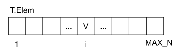
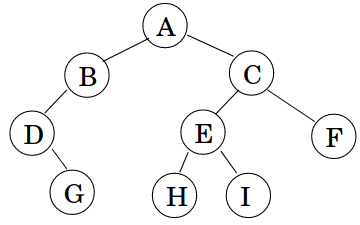
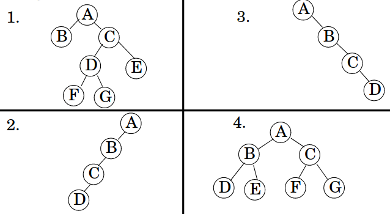

# Árvores

------

## Pré-Requisitos

São requisitos para essa aula:

- Introdução/Fundamentos de Programação (em alguma linguagem de programação)
- Interesse em aprender C/C++
- Noções de recursividade
- Noções de tipos de dados
- Noções de listas e encadeamento

*Agradecimentos especiais ao prof. Fabiano Oliveira e prof. Fábio Protti, cujos conteúdos didáticos formam a base desses slides*

# Tipo Abstrato: Árvore

------

## Árvore

A Árvore (do inglês *Tree*) é um Tipo Abstrato de Dado (TAD) que pode assumir duas formas:

- árvore $T$ vazia, denotada por $T = \emptyset$
- árvore $T$ composta por:
   * um nó $R$ chamado de *nó raiz*
   * $0$ ou mais árvores disjuntas $T_1$, $T_2$, ..., associadas a $R$; tais árvores são chamadas de *subárvores*


{width=55%}


-------

## Nomenclatura

Um conjunto de árvores é chamado *floresta*

Se T é uma árvore com raiz R, então:

- os *nós de T* são todas as raízes de subárvores de R, além da raiz de T
- um nó com 0 filhos é chamado de *folha* (do inglês *leaf*)
- se um nó F é um *filho* de um nó P, denominamos P como *pai* de F
- a raiz é um nó *ancestral* de todos nós da árvore
- todos os nós da árvore são descendentes do nó raiz


-------

## Caminhos

Um caminho em uma árvore é uma sequência de nós com relação *filho de* ou *pai de*:

{width=55%}

**Exemplos:** 

- E,C,A
- D,G,I
- C,A,D,G

-------

## Tamanho de Caminhos e Níveis

O *tamanho de um caminho* consiste no número de nós. O *nível* de um nó é o tamanho de seu caminho até a raiz:

{width=55%}


**Nível de:** A=1; C=2; F=3; H=4.  

**Desafio:** em cursos de Teoria dos Grafos é provado que existe um único caminho conectando dois nós na árvore. *Utilize sua intuição para verificar esta afirmação!*

--------

## Alturas

A *altura* de nó X é o tamanho do maior caminho que conecta X a uma folha descendente. Denotamos a altura de $X$ por $h(X)$:

{width=55%}

**Alturas:** $h(B)=1$; $h(C)=2$; $h(D)=3$; $h(A)=4$.  

A *altura da árvore* é a altura de sua raiz! 

No exemplo, $h(T) = h(A) = 4$.


--------

## Aridade

Uma árvore é dita *ordenada* se há uma ordem associada aos filhos de cada nó.

Uma árvore é dita $m$*-ária* se cada nó é *limitado a um máximo* de $m$ filhos.

{width=55%}

A árvore acima é ternária (podendo também ser $4$-ária, $5$-ária, $6$-ária, ...), mas *não é binária*!

--------

## Filho esquerdo e direito

Em *árvores binárias ordenadas* de raiz R, a primeira subárvore de cada nó é denominada *subárvore à esquerda de R* (cuja raiz se chama *filho esquerdo*), e a segunda é a *subárvore à direita de R* (cuja raiz se chama *filho direito*).

{width=50%}

**Exemplo:** B é filho esquerdo e C é filho direito de A

--------

## Estritamente $m$-ária

Uma árvore *estritamente $m$-ária* é aquela na qual cada nó possui *exatamente* $0$ ou $m$ filhos.

{width=50%}

**Exemplo:** Considere a inclusão de um filho à esquerda de C.

**Observação:** Chamada pelo NIST de [full binary tree](https://xlinux.nist.gov/dads/HTML/fullBinaryTree.html), embora também seja preferivelmente chamada de *própria* (ou *proper*).

--------

## Árvore Cheia ou Perfeita

Uma *árvore $m$-ária cheia* (ou *perfeita*) é aquela na qual todo nó com alguma subárvore vazia está no *último nível*.

{width=40%}

**Observação:** Chamada pelo NIST de [perfect binary tree](https://xlinux.nist.gov/dads/HTML/perfectBinaryTree.html) (ou *perfect k-ary tree*), embora também seja chamada de *full* ou, preferencialmente *perfect*.

--------

## Árvore Completa

Uma *árvore $m$-ária completa* é aquela na qual todo nó com alguma subárvore vazia está no *último ou penúltimo níveis, estando os nós do último nível completamente preenchidos da esquerda para a direita*.

{width=40%}


**Observação:** Chamada pelo NIST de [complete binary tree](https://xlinux.nist.gov/dads/HTML/completeBinaryTree.html). Note que alguns autores consideram essa mesma definição para árvores cheias ou perfeitas.
*O ponto fundamental é a facilidade de implementação em vetores (vide próximos slides).* [Knuth97][^1]

[^1]: [Knuth97] Donald E. Knuth, The Art of Computer Programming, Addison-Wesley, volumes 1 and 2, 2nd edition, 1997. 

--------

## Desafios

1. Qual a altura máxima de uma árvore binária com $n$ nós?

2. Qual a altura máxima de uma árvore estritamente binária com n nós?

3. Qual a altura mínima de uma árvore binária com n nós?

4. Numa árvore binária cheia com n nós, qual o número de nós no último nível?

. . .

**Solução:** $n$, $(n+1)/2$, $\lceil lg(n+1)\rceil$, $(n+1)/2$


# Implementações

--------

## Implementações de Árvores

Apresentaremos dois tipos de implementação para o TAD Árvore: Sequencial e Encadeada.

Note que, nesse momento, não apresentaremos *operações* sobre o TAD Árvore, focando somente em sua *representação interna*. 
A razão é que existem diversos tipos específicos de árvores, que apresentam operações distintas no TAD, de acordo com seu propósito.

--------

## Implementação Encadeada 1 ($m$-ária)

Consideramos uma implementação de árvore $m$-ária, com alocação encadeada de nós (alocação interna sequencial para filhos).


```.cpp
constexpr int M = 3;     // aridade M=3 (ternária)
class NoEnc1
{
public:
   char chave            // dado armazenado
   NoEnc1* nosFilhos[M]; // ponteiros para filhos
};

class ArvoreEnc1
{
public:
  NoEnc1* raiz;          // raiz da árvore
};
```

--------

## Implementação Encadeada 1 ($m$-ária)

{width=40%}


--------

## Implementação Encadeada 2 ($m$-ária)

Consideramos uma implementação de árvore $m$-ária, com alocação encadeada de nós.


```.cpp
constexpr int M = 3;     // aridade M=3 (ternária)
class NoEnc2
{
public:
   char chave;           // dado armazenado
   NoEnc2* prox;         // proximo elemento
   NoEnc2* nosFilhos;    // ponteiro único para filhos
};

class ArvoreEnc2
{
public:
  NoEnc2* raiz;          // raiz da árvore
};
```


--------

## Implementação Encadeada 2 ($m$-ária)

Consideramos uma implementação de árvore $m$-ária, com alocação encadeada de nós.


{width=40%}

--------

## Implementação Encadeada 3 (binária)

Note que podemos reescrever os ponteiros de `NoEnc2` com os termos `esq` e `dir` (nó esquerdo e nó direito).


```.cpp
class NoEnc3
{
public:
   char chave;     // dado armazenado
   NoEnc3* esq;    // filho esquerdo
   NoEnc3* dir;    // filho direito
};

class ArvoreEnc3
{
public:
  NoEnc3* raiz;    // raiz da árvore
};
```

--------

## Implementação Encadeada 3 (binária)

Consideramos uma implementação de árvore binária, com alocação encadeada de nós.


{width=40%}

--------


## Implementação Encadeada 4 (binária) - unique_ptr

Note que podemos reescrever os ponteiros de `NoEnc3` utilizando `unique_ptr`, para maior segurança:


```.cpp
class NoEnc4
{
public:
   char chave;                     // dado armazenado
   std::unique_ptr<NoEnc4> esq;    // filho esquerdo
   std::unique_ptr<NoEnc4> dir;    // filho direito
};

class ArvoreEnc4
{
public:
  std::unique_ptr<NoEnc4> raiz;    // raiz da árvore
};
```

--------

## Conversão para Árvores Binárias

Observamos pelas implementações `NoEnc2` e `NoEnc3` que uma árvore $m$-ária *qualquer* pode ser convertida para uma árvore binária. Isso reforça a importância do estudo de implementações eficientes para árvores binárias.

{width=70%}

--------


## Implementação Sequencial

As Árvores com Implementação Sequencial utilizam um array para armazenar os dados.
Assim, os dados sempre estarão em um *espaço contíguo* de memória.

**Desafio:** quanto espaço é necessário para armazenar uma *árvore qualquer* com altura $h$?

-------

## Implementação ArvoreSeq1

Consideraremos uma árvore sequencial com, no máximo, `MAX_N` elementos do tipo caractere.

```.cpp
constexpr int MAX_N = 50; // capacidade máxima da árvore
class ArvoreSeq1
{
public:
  char elem [MAX_N];      // elementos na fila
};
```

**Desafio:** Quantos níveis *cabem* nessa árvore? $\lceil log_2(50+1) \rceil = 6$

------

## Desafios na ArvoreSeq1

Note que, para esse fim, somente as *árvores completas* terão maior eficiência, utilizando uma *representação por níveis*.

{width=40%}

**Desafio:** onde fica o primeiro elemento de cada nível da árvore $T$?

--------

## Localização na ArvoreSeq1

Dado um nó $V$ na posição $i$ da árvore sequencial $T$, em que posição estão:

- o pai de $V$?
- os filhos de $V$?

{width=50%}

. . . 

**Resposta:** considerando contagem 1..MAX_N, estarão respectivamente nas posições $\lfloor i/2 \rfloor$ (pai), $2i$ e $2i+1$ (filhos).

**Desafio:** considere a contagem 0..MAX_N-1 e refaça o cálculo. 

. . .

**Solução:** posições $\lfloor (i-1)/2 \rfloor$ (pai), $2i+1$ e $2i+2$ (filhos).

--------

## Fim implementações

Fim parte de implementações.


# Operações em Árvores

-------

## Percursos em Árvores

Como "imprimir" uma árvore?

Estruturas lineares tem uma intuição mais direta para o conceito de impressão, mas para estruturas arbóreas isso já não é tão direto.
Além da impressão, muitas vezes é desejável efetuar outras operações ou *visitas* em nós de uma árvore.

Operações de *Percursos em Árvore* (do inglês, *tree traversals*) apresentam uma solução para isso:

- Percurso de pré-ordem (do inglês, *preorder*)
- Percurso de pós-ordem (do inglês, *postorder*)
- Percurso em-ordem ou ordem simétrica (do inglês, *inorder*)

-------

## Percursos: definições e aplicações

No percurso de *pré-ordem*, o nó é visitado primeiro, depois os filhos esquerdos, e finalmente, são visitados os filhos direitos.

- **Aplicação:** impressão da ordem de visita (pilha de execução) para algoritmos recursivos em árvore.

No percurso de *pós-ordem*, os filhos esquerdos são visitados primeiro, depois os filhos direitos, e finalmente o nó é visitado.

- **Aplicação:** calcular altura de um nó (note que a altura de um nó depende da altura de seus filhos).

No percurso *em-ordem*, os filhos esquerdos são visitados primeiro, depois o nó é visitado, e finalmente os filhos direitos são visitados.

- **Aplicação:** impressão "visual" da árvore como caracteres na tela (desafio!). Visita ordenada em árvores com propriedades de busca e mapas (próxima aula).


-------

## Percurso Pré-ordem

```.cpp
void preordem(auto* no) {
   if(no) {
      printf("%c\n", no->chave); // operação ou "visita"
      preordem(no->esq);
      preordem(no->dir);   
   }
}
```
{width=50%}


-------

## Pratique: Pré-ordem

Apresente o percurso de pré-ordem para as árvores abaixo:

{width=70%}

. . . 

**Solução:** 1. ABCDFGE 2. ABCD 3. ABCD 4. ABDECFG 

-------

## Percurso Pós-ordem

```.cpp
void posordem(auto* no) {
   if(no) {
      posordem(no->esq);
      posordem(no->dir);   
      printf("%c\n", no->chave); // operação ou "visita"
   }
}
```

{width=50%}


-------

## Pratique: Pós-ordem

Apresente o percurso de pós-ordem para as árvores abaixo:

{width=70%}

. . . 

**Solução:** 1. BFGDECA 2. DCBA 3. DCBA 4.DEBFGCA


-------

## Percurso Em-ordem (ordem simétrica)

```.cpp
void emordem(auto* no) {
   if(no) {
      emordem(no->esq);
      printf("%c\n", no->chave); // operação ou "visita"
      emordem(no->dir);   
   }
}
```

{width=50%}


-------

## Pratique: Em-ordem

Apresente o percurso de ordem simétrica para as árvores abaixo:

{width=70%}

. . . 

**Solução:** 1. BAFDGCE 2. DCBA 3. ABCD 4. DBEAFCG


## Fim percursos

Fim parte de percursos.

---------


## Bibliografia Recomendada


Além da bibliografia do curso, recomendamos para esse tópico:

- Szwarcfiter, J.L; Markenzon, L. Estruturas de Dados e seus Algoritmos. Rio de Janeiro, LTC, 1994.
Bibliografia Adicional:
- Cerqueira, R.; Celes, W.; Rangel, J.L. Introdução a estruturas de dados: com técnicas de programação em C. Editora, 2004.
- Cormen, T.H.; Leiserson, C.E.; Rivest, R.L.; Stein Algoritmos: Teoria e Prática. Ed. Campus, 2002.
- Cormen, T.H.; Leiserson, C.E.; Rivest, R.L.; Stein, C. Introduction to Algorithms, 3rd ed.. The MIT Press, 2009.
- Preiss, B.R. Estruturas de Dados e Algoritmos Ed. Campus, 2000;
- Knuth, D.E. The Art of Computer Programming - Vols I e III. 2nd Edition. Addison Wesley, 1973.
- Graham, R.L., Knuth, D.E., Patashnik, O. Matemática Concreta. Segunda Edição, Rio de Janeiro, LTC, 1995.
- Livro "The C++ Programming Language" de Bjarne Stroustrup
- Dicas e normas C++: https://github.com/isocpp/CppCoreGuidelines


# Agradecimentos

-----

## Pessoas

Em especial, agradeço aos colegas que elaboraram bons materiais, como o prof. Fabiano Oliveira (IME-UERJ), e o prof. Jayme Szwarcfiter cujos conceitos formam o cerne desses slides.

Estendo os agradecimentos aos demais colegas que colaboraram com a elaboração do material do curso de [Pesquisa Operacional](https://github.com/igormcoelho/curso-pesquisa-operacional-i), que abriu caminho para verificação prática dessa tecnologia de slides.

-----

## Software

Esse material de curso só é possível graças aos inúmeros projetos de código-aberto que são necessários a ele, incluindo:

- pandoc
- LaTeX
- GNU/Linux
- git
- markdown-preview-enhanced (github)
- visual studio code
- atom
- revealjs
- groomit-mpx (screen drawing tool)
- xournal (screen drawing tool)
- ...

-----

## Empresas

Agradecimento especial a empresas que suportam projetos livres envolvidos nesse curso:

- github
- gitlab
- microsoft
- google
- ...

-----

## Reprodução do material

Esses slides foram escritos utilizando pandoc, segundo o tutorial ilectures:

- https://igormcoelho.github.io/ilectures-pandoc/

Exceto expressamente mencionado (com as devidas ressalvas ao material cedido por colegas), a licença será Creative Commons.

**Licença:** CC-BY 4.0 2020

Igor Machado Coelho

-------

## This Slide Is Intentionally Blank (for goomit-mpx)
