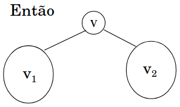
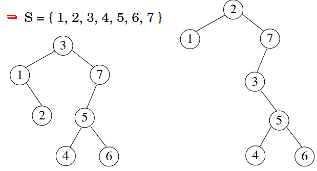
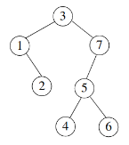
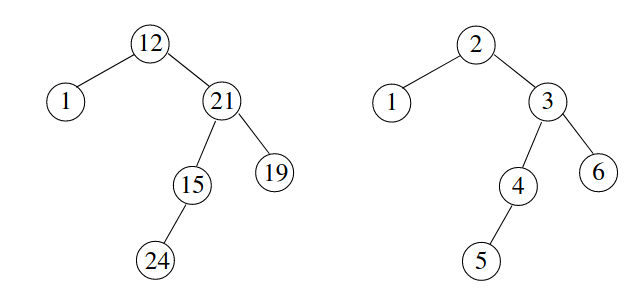

# Dicionários e Árvores de Busca

------

## Pré-Requisitos

São requisitos para essa aula:

- Introdução/Fundamentos de Programação (em alguma linguagem de programação)
- Interesse em aprender C/C++
- Noções de recursividade
- Noções de tipos de dados
- Noções de listas e encadeamento
- Aula de Árvores

*Agradecimentos especiais ao prof. Fabiano Oliveira e prof. Fábio Protti, cujo conteúdo didático forma a base desses slides*

# Tipo Abstrato: Dicionário

------

## Dicionários 

O Dicionário (do inglês *Dictionary*) ou Mapa (do inglês *Map*) é um Tipo Abstrato de Dado (TAD) que visa oferecer operações de *chave-valor*. Também é conhecido como *mapeamento*.

Supondo um mapeamento M do tipo *caractere para inteiro*, por exemplo:

- Podemos *adicionar* uma chave B com valor 100
- Podemos *adicionar* uma chave C com valor 150
- Podemos *adicionar* uma chave D com valor 200
- Podemos *buscar* a chave B, recebendo o valor 100
- Podemos *remover* a chave D
- Podemos *atualizar* o valor da chave B para 120

```
M:
B -> 120
C -> 150
...
```


-------

## Dicionários na computação

Dicionários são estruturas fundamentais na própria computação. 

Por exemplo, algumas linguagens de programação (como Python) oferecem suporte nativo a dicionários:

```{.python}
>>> M = dict()
>>> M['A'] = 100
>>> M['A']
100
```

Assim como *arrays*, servem para armazenar um conjunto de dados de certo tipo (estrutura homogênea). Uma diferença em relação a vetores, é que permitem indexação da *chave de busca* por tipos arbitrários.

--------

## Operações de um Dicionário

Um Dicionário requer 3 operações básicas: 

- consultar *chave* (do inglês *at*)
- adicionar *chave-valor* (do inglês *add*)
- remover *chave* (do inglês *remove*)


--------

## Definição do *Conceito* Dicionário em C++

O *conceito* de dicionário somente requer suas três operações básicas. Como consideramos um *dicionário genérico* (mapa de inteiro, char, etc), definimos um *conceito genérico* chamado `DicionarioTAD` (note que precisamos de *dois tipos genéricos*, para *chave* e *valor*):

```{.cpp}
template<typename Agregado, typename TChave, typename TValor>
concept bool
DicionarioTAD = requires(Agregado a, TChave c, TValor v)
{
   // requer operação 'consulta'
   { a.consulta(c) };
   // requer operação 'adiciona'
   { a.adiciona(c, v) };
   // requer operação 'remove'
   { a.remove(c) };
};
```

---------

## Exemplo: Dicionário de `char` para `int`

```{.cpp}
class DicionarioCI
{
public:
   // ... 
   int consulta(char c) {
      // ...
   }
   void adiciona(char c, int v) {
      // ...
   }
   int remove(char c) {
      // ...
   }
};
// verifica estrutura do DicionarioTAD
static_assert(DicionarioTAD<DicionarioCI, char, int>);
```

---------

## Exemplo de Uso com `DicionarioCI`

Adiciona pares chave-valor `('A', 200)` e `('B', 200)`. Depois faz consultas e remove chave `'B'`.

```{.cpp}
int main() {
   DicionarioCI d;
   d.cria();                        // inicializa estrutura
   d.adiciona('A', 100);
   d.adiciona('B', 200);
   printf("%d\n", d.consulta('A')); // 100
   printf("%d\n", d.consulta('B')); // 200
   d.remove('B');                   // 200
   // ...
   d.libera();                      // libera estrutura
   
   return 0;
}
```

---------

## Como implementar dicionários de forma eficiente?

Existem duas formas eficientes de implementação de dicionários:

- Árvores de Busca (essa aula)
- Tabelas de Dispersão/*Hash* (aula futura)


# Árvores de Busca

------

## Problema de Busca

Consideramos o *Problema da Busca* em que, dados:

- Conjunto de chaves $S = \{s_1, ..., s_i, ..., s_n\}$, $s_1 < ... < s_n$
- Dado $x$ (do mesmo tipo dos elementos de $S$)

**Responda:** $x$ pertence a $S$?

Em caso positivo, encontrar $s_i$ tal que $s_i = x$.

**Desafio:** Como organizar os dados de forma a facilitar a operação de busca?

------

## Árvore Binária de Busca: Definição

Podemos utilizar uma Árvore Binária rotulada $T$, tal que:

- $T$ possui $N$ nós. Cada nó $v$ corresponde a uma chave distinta $s_i \in S$ e possui como rótulo o *valor* $r(v)=s_i$
- Sejam $v$, $v_1$, $v_2$ nós distintos de $T$, sendo $v_1$ pertencente à subárvore esquerda de $v$, e $v_2$ à subárvore direita de $v$, tais que: $r(v_1) < r(v)$ e $r(v_2) > r(v)$

{width=30%}

*$T$ é uma Árvore Binária de Busca (ABB)*


------

## Árvore Binária de Busca: Exemplo

{width=70%}


------

## Estrutura de Árvore Binária

Relembrando (aula de Árvores) a estrutura de árvore binária considerada:

```{.cpp}
class NoEnc3
{
public:
   char chave;     // dado armazenado
   NoEnc3* esq;    // filho esquerdo
   NoEnc3* dir;    // filho direito
};

class ArvoreEnc3
{
public:
  NoEnc3* raiz;    // raiz da árvore
};
```

------

## Problema da Busca com uma ABB

Podemos resolver o *Problema da Busca*, com chave de busca $k$, através de uma ABB.

**Ideia Geral**: 

- Parta do nó raiz $v$
- Verifique se a chave de $v$ é $c$, ou seja, `v->chave == c`
- Em caso positivo, o algoritmo termina (chave encontrada)
- Caso contrário, verifique se:
   *  `c < v->chave`: refaça o algoritmo na subárvore esquerda
   *  `c > v->chave`: refaça o algoritmo na subárvore direita
- Caso o nó $v$ não exista, a busca termina.

{width=20%}

--------

## Tarefa

Avalie se as árvores abaixo são árvores binárias de busca:



. . .

**Solução:** nenhuma delas é! Erros: $24 < 15$, $19 > 21$, $4 < 3$ e $5 < 4$

--------

## Implementação: `buscaABB`

Implementação da busca em árvores binárias de busca:

```{.cpp}
std::optional<char> buscaABB(auto* no, char c) {
   if(!no)
      return std::nullopt;          // chave não encontrada
   if(no->chave == c)
      return std::make_optional(c); // chave encontrada
   if(c < no->chave)
      return buscaABB(no->esq, c);  // recursão esquerda
   else
      return buscaABB(no->dir, c);  // recursão direita
}
```

**Pergunta:** *Quantos chamadas recursivas esse algoritmo pode precisar?*

**Resposta:** Em uma árvore degenerada com $N$ nós, até $N$ passos (observe que, nesse caso, $N$ também é a *altura da árvore*)

---------

## Exercício

Encontre o *pior caso* (pior *chave de busca*) para a execução do algoritmo `buscaABB` nas quatro árvores abaixo (avalie primeiro se são ou não árvores binárias de busca):

{width=70%}

. . .

**Solução:** 1. N/A, 2. N/A, 3. E, 4. N/A 

---------

## Árvore Binária de Busca Ótima

Como a `buscaABB` depende a altura da árvore, qual o melhor caso possível para a busca (menor altura possível) em uma árvore binária com $N$ nós?

Relembrando: uma árvore binária completa (ou cheia/perfeita) possui $\lceil \log_2 (N+1) \rceil$ níveis.
**Verifique essa afirmação:**

{width=70%}

. . .

**Solução:** 1. N/A, 2. N/A, 3. N/A, 4. $N=7$ e $\log_2 8 = 3$


# Árvores Balanceadas

-------

## Árvores Balanceadas

Um tipo importante de Árvore Binária de Busca é a *balanceada*, que resolve o problema de degeneração da árvore pelo controle de sua altura.

Tal controle é conseguido pelo cálculo de um **fator de balanceamento (FB)** para cada nó, definido por: altura do filho esquerdo - altura do filho direito. Observe que se o filho não existe, então sua altura será 0 (zero).

---------

## Exercício

Calcule o fator de balanceamento da raiz das quatro árvores abaixo e informe se estão balanceadas:

{width=70%}

. . .

**Solução:** 1. $1-3=-2$ (não), 2. $0-3=-3$ (não), 3. $3-0=3$ (não), 4. $2-2=0$ (sim)


# Implementação de Dicionário com Árvores

## Implementação de Dicionário com Árvores

---------

## Bibliografia Recomendada


Além da bibliografia do curso, recomendamos para esse tópico:

- Szwarcfiter, J.L; Markenzon, L. Estruturas de Dados e seus Algoritmos. Rio de Janeiro, LTC, 1994.
Bibliografia Adicional:
- Cerqueira, R.; Celes, W.; Rangel, J.L. Introdução a estruturas de dados: com técnicas de programação em C. Editora, 2004.
- Cormen, T.H.; Leiserson, C.E.; Rivest, R.L.; Stein Algoritmos: Teoria e Prática. Ed. Campus, 2002.
- Cormen, T.H.; Leiserson, C.E.; Rivest, R.L.; Stein, C. Introduction to Algorithms, 3rd ed.. The MIT Press, 2009.
- Preiss, B.R. Estruturas de Dados e Algoritmos Ed. Campus, 2000;
- Knuth, D.E. The Art of Computer Programming - Vols I e III. 2nd Edition. Addison Wesley, 1973.
- Graham, R.L., Knuth, D.E., Patashnik, O. Matemática Concreta. Segunda Edição, Rio de Janeiro, LTC, 1995.
- Livro "The C++ Programming Language" de Bjarne Stroustrup
- Dicas e normas C++: https://github.com/isocpp/CppCoreGuidelines


# Agradecimentos

-----

## Pessoas

Em especial, agradeço aos colegas que elaboraram bons materiais, como o prof. Fabiano Oliveira (IME-UERJ), e o prof. Jayme Szwarcfiter cujos conceitos formam o cerne desses slides.

Estendo os agradecimentos aos demais colegas que colaboraram com a elaboração do material do curso de [Pesquisa Operacional](https://github.com/igormcoelho/curso-pesquisa-operacional-i), que abriu caminho para verificação prática dessa tecnologia de slides.

-----

## Software

Esse material de curso só é possível graças aos inúmeros projetos de código-aberto que são necessários a ele, incluindo:

- pandoc
- LaTeX
- GNU/Linux
- git
- markdown-preview-enhanced (github)
- visual studio code
- atom
- revealjs
- groomit-mpx (screen drawing tool)
- xournal (screen drawing tool)
- ...

-----

## Empresas

Agradecimento especial a empresas que suportam projetos livres envolvidos nesse curso:

- github
- gitlab
- microsoft
- google
- ...

-----

## Reprodução do material

Esses slides foram escritos utilizando pandoc, segundo o tutorial ilectures:

- https://igormcoelho.github.io/ilectures-pandoc/

Exceto expressamente mencionado (com as devidas ressalvas ao material cedido por colegas), a licença será Creative Commons.

**Licença:** CC-BY 4.0 2020

Igor Machado Coelho

-------

## This Slide Is Intentionally Blank (for goomit-mpx)
