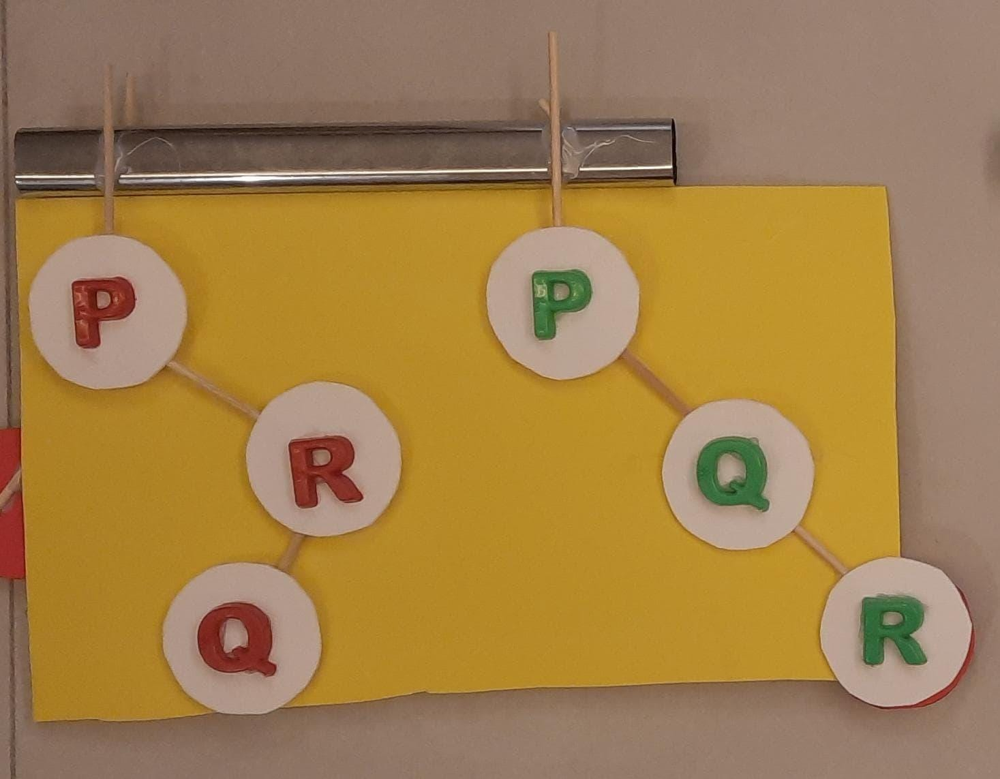

# Dicionários

------

## Pré-Requisitos

São requisitos para essa aula:

- Introdução/Fundamentos de Programação (em alguma linguagem de programação)
- Interesse em aprender C/C++
- Noções de recursividade
- Noções de tipos de dados
- Noções de listas e encadeamento
- Aula de Árvores

*Agradecimentos especiais ao prof. Fabiano Oliveira e prof. Fábio Protti, cujo conteúdo didático forma a base desses slides*

# Tipo Abstrato: Dicionário

------

## Dicionários 

O Dicionário (do inglês *Dictionary*) ou Mapa (do inglês *Map*) é um Tipo Abstrato de Dado (TAD) que visa oferecer operações de *chave-valor*. Também é conhecido como *mapeamento*.

Supondo um mapeamento M do tipo *caractere para float*, por exemplo:

- Podemos *adicionar* uma chave B com valor 100.0
- Podemos *adicionar* uma chave C com valor 150.0
- Podemos *adicionar* uma chave D com valor 200.0
- Podemos *buscar* a chave B, recebendo o valor 100.0
- Podemos *remover* a chave D
- Podemos *atualizar* o valor da chave B para 120.0

```
M:
B -> 120.0
C -> 150.0
...
```


-------

## Dicionários na computação

Dicionários são estruturas fundamentais na própria computação. 

Por exemplo, algumas linguagens de programação (como Python) oferecem suporte nativo a dicionários:

```{.python}
>>> M = dict()
>>> M['A'] = 100.0
>>> M['A']
100.0
```

Assim como *arrays*, servem para armazenar um conjunto de dados de certo tipo (estrutura homogênea). Uma diferença em relação a vetores, é que permitem indexação da *chave de busca* por tipos arbitrários.

--------

## Operações de um Dicionário

Um Dicionário requer 3 operações básicas: 

- consultar *chave* (do inglês *at*)
- adicionar *chave-valor* (do inglês *add*)
- remover *chave* (do inglês *remove*)


--------

## Definição do *Conceito* Dicionário em C++

O *conceito* de dicionário somente requer suas três operações básicas. Como consideramos um *dicionário genérico* (mapa de inteiro, char, etc), definimos um *conceito genérico* chamado `DicionarioTAD` (note que precisamos de *dois tipos genéricos*, para *chave* e *valor*):

```.cpp
template<typename Agregado, typename TChave, typename TValor>
concept 
DicionarioTAD = requires(Agregado d, TChave c, TValor v) {
   // requer operação 'consulta'
   { d.consulta(c) };
   // requer operação 'adiciona'
   { d.adiciona(c, v) };
   // requer operação 'remove'
   { d.remove(c) };
};
```

---------

## Exemplo: Dicionário de `char` para `float`

```.cpp
struct DicionarioCF {
   // ... 
   int consulta(char c) {
      // ...
   }
   void adiciona(char c, float v) {
      // ...
   }
   int remove(char c) {
      // ...
   }
};
// verifica estrutura do DicionarioTAD
static_assert(DicionarioTAD<DicionarioCF, char, float>);
```

---------

## Exemplo de Uso com `DicionarioCI`

Adiciona pares chave-valor `('A', 100.0)` e `('B', 200.0)`. Depois faz consultas e remove chave `'B'`.

```.cpp
auto main() -> int {
   DicionarioCF d;
   d.cria();                            // inicializa
   d.adiciona('A', 100.0);
   d.adiciona('B', 200.0);
   std::println("{}", d.consulta('A')); // 100.0
   std::println("{}", d.consulta('B')); // 200.0
   d.remove('B');                       // 200.0
   // ...
   d.libera();                          // libera estrutura
   
   return 0;
}
```

---------

## Como implementar dicionários de forma eficiente?

Existem duas formas eficientes de implementação de dicionários:

- Árvores de Busca (aula anterior) + Balanceamento (essa aula!)
- Tabelas de Dispersão/*Hash* (aula futura)


# Árvores Binárias de Busca (breve revisão)

## Árvore Binária de Busca: Exemplo

Exemplos de ABB, contendo nós D, E, F, L, M, N e O.

::::::::::{.columns}

:::::{.column width=45%}

{height=40%}

:::::

:::::{.column  width=50%}

{height=40%}

:::::

::::::::::

# Árvores Balanceadas

-------

## Árvores Balanceadas

Um tipo importante de Árvore Binária de Busca é a *balanceada*, que resolve o problema de degeneração da árvore pelo controle de sua altura.

Tal controle é conseguido pelo cálculo de um **fator de balanceamento (FB)** para cada nó, definido por: altura do filho esquerdo - altura do filho direito. Observe que se o filho não existe, então sua altura será 0 (zero).

---------

## Exercício

Calcule o fator de balanceamento da raiz das quatro árvores abaixo e informe se estão balanceadas:


::::::::::{.columns}

:::::{.column width=70%}

{width=90%}

:::::

:::::{.column  width=30%}

{height=40%}

:::::

::::::::::

. . .

**Solução:** 1. $1-3=-2$ (não), 2. $0-3=-3$ (não), 3. $3-0=3$ (não), 4. $2-2=0$ (sim), Fig.7 $3-2=1$ (sim)

# Operações Básicas em ABBB (Exercícios Práticos)

## Exercício: Calcule a altura de um nó de uma ABBB

Considere uma Árvore Binária de Busca Balanceada (ABBB) com controle de altura.
Dado um nó do tipo `NoEnc7`, calcule a altura com base na altura dos filhos.
Faça um método auxiliar `get_altura(no)`, que dá altura zero para um nó vazio:

`int get_altura(const NoEnc7* no) { ... }`

`int calc_altura(const NoEnc7* no)  { ... }`

:::::::: ||
::::: |{30%}

```.cpp
struct NoEnc7 {
   char chave;  
   float dado; 
   int h;      
   NoEnc7* esq; 
   NoEnc7* dir; 
   NoEnc7* pai;  
};
```

:::::

. . .

::::: |{55%}

```.cpp
int get_altura(const NoEnc7* no) {
   return no ? no->h : 0; 
}
int calc_altura(const NoEnc7* no) 
{                      // pre(no)
    int he = get_altura(no->esq);
    int hd = get_altura(no->dir);
    return 1 + (he > hd? he : hd); 
}
```

:::::
::::::::

## Exercício: Calcule o fator de balanceamento de uma ABBB

Considere uma Árvore Binária de Busca Balanceada (ABBB) com controle de altura.
Dado um nó do tipo `NoEnc7`, calcule o fator de balanceamento 
com método auxiliar `get_altura(no)` já criado previamente:

`int fb(const NoEnc7* no)  { ... }`

:::::::: ||
::::: |{30%}

```.cpp
struct NoEnc7 {
   char chave;  
   float dado; 
   int h;      
   NoEnc7* esq; 
   NoEnc7* dir; 
   NoEnc7* pai;  
};
```

:::::

. . .

::::: |{55%}

```.cpp
int get_altura(const NoEnc7* no) {
   return no ? no->h : 0; 
}

int fb(const NoEnc7* no)
// pre(no)               // C++26
{ 
   return get_altura(no->esq) - 
          get_altura(no->dir); 
}
```

:::::
::::::::

## Exercício: Propriedade de um nó regulado em ABBB

Dado um nó do tipo `NoEnc7`, escreva a propriedade `eh_regulado`,
que retorna verdadeiro caso seu fator de balanceamento seja no máximo 1 em módulo:

`bool eh_regulado(auto* no) { ... }`

:::::::: ||
::::: |{30%}

```.cpp
struct NoEnc7 {
   char chave;  
   float dado; 
   int h;      
   NoEnc7* esq; 
   NoEnc7* dir; 
   NoEnc7* pai;  
};
```

:::::

. . .

::::: |{55%}

```.cpp
bool eh_regulado(auto* no) 
// pre(no)        // C++26
{
    return fb(no) == 1 || 
           fb(no) == 0 || 
           fb(no) == -1;
} 
```

:::::
::::::::


# Implementação de Dicionário

## Dicionário com AVL

Existem duas implementações populares de árvores balanceadas para dicionários: AVL e rubro-negra.

Iremos explorar a árvore AVL, por sua simplicidade.

Criada em 1962 pelos russos Georgy Adelson-Velsky e Evgenii Landis, ela consegue manter um balanceamento após uma operação de inserção ou remoção.

Basta calcular o fator de balanceamento em cada nó e, caso esteja desbalanceada, algum tipo de operação de rotação será feita.

Nos próximos slides demonstramos as rotações possíveis.


## Rotação Simples à Direita

Ocorre quando os fatores de balanceamento são 2 e 1 (ou 0).

{height=40%}

Após rotação à direita, a árvore fica enraizada em Y, com X à esquerda e Y à direita.

## Rotação Simples à Esquerda

Ocorre quando os fatores de balanceamento são -2 e -1 (ou 0).

{height=40%}

Após rotação à direita, a árvore fica enraizada em Q, com P à esquerda e R à direita.


## Rotação Dupla à Direita

Ocorre quando os fatores de balanceamento são 2 e -1.
Isso exige duas rotações, uma à esquerda e outra à direita.

::::::::::{.columns}

:::::{.column width=50%}

{height=40%}

:::::

:::::{.column  width=50%}

{height=40%}

:::::

::::::::::


Após rotação à esquerda em X, a árvore fica enraizada em Z, mas ainda desbalanceada como 2 1.
Uma nova rotação à direita da raiz Z resolve o problema.

## Rotação Dupla à Esquerda

Ocorre quando os fatores de balanceamento são -2 e 1.
Isso exige duas rotações, uma à direita e outra à esquerda.

::::::::::{.columns}

:::::{.column width=50%}

{height=40%}

:::::

:::::{.column  width=50%}

{height=40%}

:::::

::::::::::


Após rotação à direita em R, a árvore fica enraizada em P, mas ainda desbalanceada como -2 -1.
Uma nova rotação à esquerda da raiz P resolve o problema.


## Praticando as Rotações

Considere uma árvore A3 com nós M, D, O, B, F, N, S, E, L.
A exclusão de S não acarreta em desbalanceamento.
A exclusão de B gera um desbalanceamento no nó D, com fator 0-2=-2 seguido de 0.

Isso indica uma Rotação Simples à Esquerda, no nó D.

::::::::::{.columns}

:::::{.column width=70%}

{height=30%}

:::::

:::::{.column  width=30%}

{height=30%}

:::::

::::::::::

Qual o final após a rotação? F substitui D, tornando E seu filho à esquerda, seguido de D à esquerda, sendo que o filho à direita de F se torna L.
A árvore se torna balanceada.

# Rotações em AVL (Exercícios Práticos)

## Exercício: Faça uma Rotação à Direita em uma AVL

Dado um nó do tipo `NoEnc7` desregulado (com peso à esquerda), 
faça uma rotação à direita na raiz de uma subárvore e
retorne a nova raiz da subárvore:

`NoEnc7* rotDir(NoEnc7* const raiz) { ... }`

::: -
:::::::: ||
::::: |{30%}

```.cpp
struct NoEnc7 {
   char chave;  
   float dado; 
   int h;      
   NoEnc7* esq; 
   NoEnc7* dir; 
   NoEnc7* pai;  
};
```

:::::

. . .

::::: |{55%}

```.cpp
NoEnc7* rotDir(NoEnc7* const raiz) 
// pre(raiz)             // C++26
{
    auto* x = raiz->esq;
    raiz->esq = x->dir;
    if(x->dir) x->dir->pai = raiz;
    x->dir = raiz;
    x->pai = raiz->pai;
    raiz->pai = x;
    raiz->h = calc_altura(raiz);
    x->h    = calc_altura(x);
    return x;  // nova raiz
}
```

:::::
::::::::
:::

## Exercício: Faça o Balanceamento de um nó de AVL

Dado um nó do tipo `NoEnc7` regulado ou desregulado,
efetue o balanceamento (se necessário) e
retorne a nova raiz da subárvore:

`NoEnc7* balanceia(NoEnc7* const raiz) { ... }`

::: -
:::::::: ||
::::: |{30%}

```.cpp
struct NoEnc7 {
   char chave;  
   float dado; 
   int h;      
   NoEnc7* esq; 
   NoEnc7* dir; 
   NoEnc7* pai;  
};
```

:::::

. . .

::::: |{55%}

```.cpp
NoEnc7* balanceia(NoEnc7* const raiz) 
// pre(raiz)                   // C++26
// post(out: eh_regulado(out)) // C++26
{
  int f = fb(raiz); if (f > 1) {
      if (fb(raiz->esq) < 0)
        raiz->esq = rotEsq(raiz->esq);
    return rotDir(raiz);
  }; if (f < -1) {
      if (fb(raiz->dir) > 0)
        raiz->dir = rotDir(raiz->dir);
      return rotEsq(raiz);
  }
  return raiz; // sem rotação necessária!
}
```

:::::
::::::::
:::

# Implementação de AVL

## Estrutura de AVL

Relembrando a estrutura de árvore binária com pai, chave-valor e alturas:

```.cpp
struct NoEnc7 {
   char chave;     // chave de busca
   float dado;     // valor armazenado
   int h;          // altura
   NoEnc7* esq;    // filho esquerdo
   NoEnc7* dir;    // filho direito
   NoEnc7* pai;    // pai
};

struct AVL {
  NoEnc7* raiz;    // raiz da árvore
  int N;           // número de nós
  ...              // métodos típicos: busca, upsert, remove, ...
};
```


## Implementação: `upsertAVL`

Implementação de "upserção" (inserção, se chave nova, ou atualização, se chave já existe) em árvore binária de busca balanceada não-vazia:

::: -
```.cpp
NoEnc7* upsertAVL(char c, float d, NoEnc7* const raiz) 
// pre(raiz)                                  // C++26
{  
  if (c == raiz->chave) { raiz->dado = d; return raiz; }
  if (c < raiz->chave) {
    if (raiz->esq) raiz->esq = upsertAVL(c, d, raiz->esq);
    else raiz->esq = 
      new NoEnc7{.chave=c,.dado=d,.h=1,.esq=0,.dir=0,.pai=raiz};
  } else {
    if (raiz->dir) raiz->dir = upsertAVL(c, d, raiz->dir);
    else raiz->dir = 
      new NoEnc7{.chave=c,.dado=d,.h=1,.esq=0,.dir=0,.pai=raiz};
  }
  raiz->h = calc_altura(raiz); // sempre muda altura até raiz!
  return balanceia(raiz);
}
```
:::


---------

## Bibliografia Recomendada


Além da bibliografia do curso, recomendamos para esse tópico:

- Szwarcfiter, J.L; Markenzon, L. Estruturas de Dados e seus Algoritmos. Rio de Janeiro, LTC, 1994.
Bibliografia Adicional:
- Cerqueira, R.; Celes, W.; Rangel, J.L. Introdução a estruturas de dados: com técnicas de programação em C. Editora, 2004.
- Cormen, T.H.; Leiserson, C.E.; Rivest, R.L.; Stein Algoritmos: Teoria e Prática. Ed. Campus, 2002.
- Cormen, T.H.; Leiserson, C.E.; Rivest, R.L.; Stein, C. Introduction to Algorithms, 3rd ed.. The MIT Press, 2009.
- Preiss, B.R. Estruturas de Dados e Algoritmos Ed. Campus, 2000;
- Knuth, D.E. The Art of Computer Programming - Vols I e III. 2nd Edition. Addison Wesley, 1973.
- Graham, R.L., Knuth, D.E., Patashnik, O. Matemática Concreta. Segunda Edição, Rio de Janeiro, LTC, 1995.
- Livro "The C++ Programming Language" de Bjarne Stroustrup
- Dicas e normas C++: https://github.com/isocpp/CppCoreGuidelines


# Agradecimentos

-----

## Pessoas

Em especial, agradeço aos colegas que elaboraram bons materiais, como o prof. Fabiano Oliveira (IME-UERJ), e o prof. Jayme Szwarcfiter cujos conceitos formam o cerne desses slides.

Estendo os agradecimentos aos demais colegas que colaboraram com a elaboração do material do curso de [Pesquisa Operacional](https://github.com/igormcoelho/curso-pesquisa-operacional-i), que abriu caminho para verificação prática dessa tecnologia de slides.

-----

## Software

Esse material de curso só é possível graças aos inúmeros projetos de código-aberto que são necessários a ele, incluindo:

- pandoc
- LaTeX
- GNU/Linux
- git
- markdown-preview-enhanced (github)
- visual studio code
- atom
- revealjs
- groomit-mpx (screen drawing tool)
- xournal (screen drawing tool)
- ...

-----

## Empresas

Agradecimento especial a empresas que suportam projetos livres envolvidos nesse curso:

- github
- gitlab
- microsoft
- google
- ...

-----

## Reprodução do material

Esses slides foram escritos utilizando pandoc, segundo o tutorial ilectures:

- https://igormcoelho.github.io/ilectures-pandoc/

Exceto expressamente mencionado (com as devidas ressalvas ao material cedido por colegas), a licença será Creative Commons.

**Licença:** CC-BY 4.0 2020

Igor Machado Coelho

-------

## This Slide Is Intentionally Blank (for goomit-mpx)
