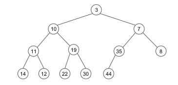
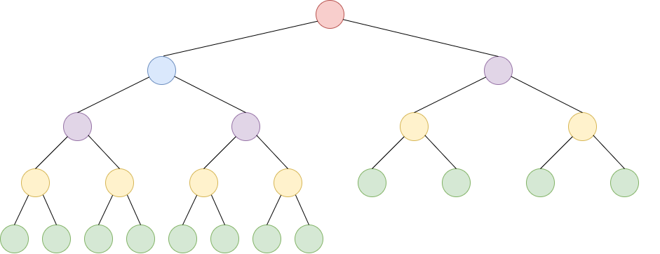
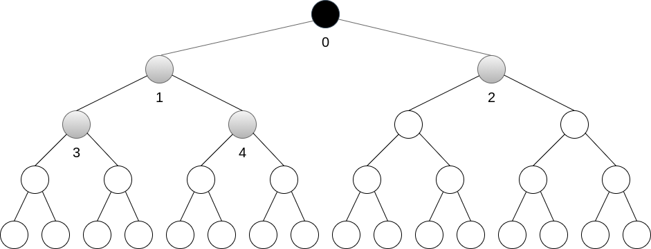
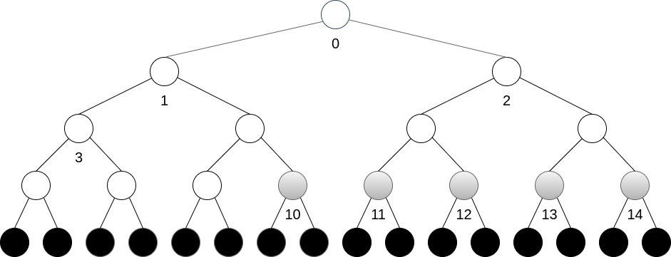
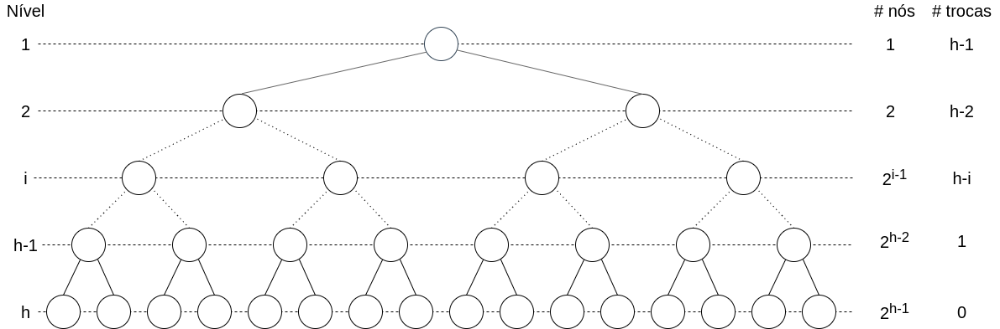

# Filas de Prioridade

------

## Pré-Requisitos

São requisitos para essa aula:

- Introdução/Fundamentos de Programação (em alguma linguagem de programação)
- Interesse em aprender C/C++
- Noções de tipos de dados
- Noções de listas e encadeamento
- Aula de filas
- Aula de árvores


# Tipo Abstrato: Fila de Prioridade

------

## Fila de Prioridade

A Fila de Prioridade (do inglês *Priority Queue*) é um Tipo Abstrato de Dado (TAD) que opera de forma similar a uma Fila.

Lembramos que o TAD Fila tem comportamento FIFO (*first-in first-out*), onde o elemento de *maior prioridade para sair da fila* é o elemento que *entrou primeiro na fila*.

O conceito de *prioridade* é explicitado  nas Filas de Prioridade através de um *valor numérico*. Nesse caso, a lógica de prioridade pode operar pelo *menor* ou pelo *maior* valor, dependendo da aplicação.

-------

## Filas de Prioridade na Computação

Filas de Prioridade são estruturas fundamentais na própria computação.
Também são úteis na implementações de algoritmos em grafos, como a busca por *árvores geradoras mínimas* (aulas futuras).


Por exemplo, quando se envia pacotes de dados a roteadores, existem mecanismos que podem tirar vantagem de *valores de prioridade* entre pacotes (dados de voz e de download, etc). Uma interpretação cotidiana poderia ser uma *fila prioritária por idade*, na qual os indivíduos *mais velhos* seriam sempre atendidos antes dos *mais novos*.


{width=20%}


--------

## Operações de uma Fila de Prioridade

Uma Fila de Prioridade é uma estrutura de dados com uma *direção pre-definida* (vamos assumir *maior prioridade* para o *menor valor*), consistindo de 3 operações básicas:

- frente "mais prioritária" (*peek min* ou *find min*)
- enfileira (*enqueue*, *push* ou *insert*)
- desenfileira "mais prioritário" (*dequeue min*, *pop min* ou *extract min*)

As operações trabalham com *chaves numéricas* e, opcionalmente, um conteúdo atrelado a cada chave.
Outra operação comum no TAD, embora considerada uma *operação interna*, é a de *redução de chave* (*decrease key*).

--------

## Implementações

A implementação do TAD Fila de Prioridade geralmente se dá através de uma implementação de *árvores de prioridade* denominada *heap* binário. O heap (ou *min heap*) é uma *árvore binária completa* com a seguinte propriedade:

- se $x$ é pai de $y$, então $x \leq y$

{width=70%}

-------

## Definição do *Conceito* Fila de Prioridade em C++

O *conceito* de fila de prioridade somente requer suas três operações básicas. Como consideramos uma *fila de prioridade genérica* (fila de inteiro, char, etc), definimos um *conceito genérico* chamado `FilaPrioridadeTAD`:

```{.cpp}
template<typename Agregado, typename Tipo>
concept bool
FilaPrioridadeTAD = requires(Agregado a, Tipo t)
{
   // requer operação 'frente' mais prioritária 
   { a.frente() };
   // requer operação 'insere' sobre tipo 't'
   { a.insere(t) };
   // requer operação 'remove' mais prioritário
   { a.remove() };
};
```
Note que o tipo genérico pode ser estendido para comportar um elemento interno, além da chave numérica.

-------

## Utilização da Fila de Prioridade

Antes de completar as funções, utilizaremos o `FilaPrioridadeTAD`:

```{.cpp}
int main () {
   FilaPrioridadeTAD h = // ... inicializa tipo
   // h.cria();
   h.insere(20);
   h.insere(10);
   h.insere(30);
   printf("%c\n", h.frente());      
   printf("%c\n", h.remove());  
   h.insere(25);
   while(p.N > 0)
      printf("%c\n", h.remove());
   // h.libera();
   return 0;
}
```
***Verifique as impressões em tela:*** *10 10 20 25 30*

# Operações em um *heap*

--------

## Implementação *heap* com vetor

Apesar de sua estrutura de árvore, podemos representá-la eficientemente com um vetor, numa implementação puramente sequencial.

{width=70%}

Representação por níveis (*árvore completa*):
```
| 3 | 10 | 7 | 11 | 19 | 35 | 8 | 14 | 12 | 22 | 30 | 44 |
```

Assim, os dados sempre estarão em um *espaço contíguo* de memória.


---------


## Algoritmo FilaPrioridadeTAD *frente* 

A operação `frente` retorna o elemento mais prioritário do heap.
Felizmente, ele sempre será a raiz da árvore!

{width=70%}

Representação por níveis (*árvore completa*):
```
| 3 | 10 | 7 | 11 | 19 | 35 | 8 | 14 | 12 | 22 | 30 | 44 |
```

**Desafio**: verifique se é possível o elemento mais prioritário não estar na raiz do heap.

---------

## Algoritmo FilaPrioridadeTAD *insere* - Parte 1/2

A operação `insere` em adiciona um novo elemento de acordo com sua prioridade.
Como manter a corretude das propriedades do heap?

**Exemplo:** como inserir o elemento $5$?

{width=70%}

Representação por níveis (*árvore completa*):
```
| 3 | 10 | 7 | 11 | 19 | 35 | 8 | 14 | 12 | 22 | 30 | 44 |
```

-------

## Algoritmo FilaPrioridadeTAD *insere* - Parte 2/2

Para manter a corretude das propriedades do heap, em especial, de uma *árvore completa*, adicionamos o elemento na *última posição do vetor*.

**Exemplo:** como inserir o elemento $5$?

{width=30%}

Representação por níveis (*árvore completa*):
```
| 3 | 10 | 7 | 11 | 19 | 35 | 8 | 14 | 12 | 22 | 30 | 44 |
```

Como *corrigir* a árvore? **Solução:** trocas sucessivas *subindo* até a raiz.

```
|3| 10 | 7 | 11 | 19 | 35 | 8 | 14 | 12 | 22 | 30 | 44 |5|
|3| 10 | 7 | 11 | 19 | *5 | 8 | 14 | 12 | 22 | 30 | 44 |*35|
|3| 10 | *5 | 11 | 19 | *7 | 8 | 14 | 12 | 22 | 30 | 44 |*35|
```

-------


## Algoritmo FilaPrioridadeTAD *remove* - Parte 1/2

A operação `remove` em adiciona um novo elemento de acordo com sua prioridade.
Como manter a corretude das propriedades do heap?

**Exemplo:** como remover o elemento $3$?

{width=70%}

Representação por níveis (*árvore completa*):
```
| 3 | 10 | 7 | 11 | 19 | 35 | 8 | 14 | 12 | 22 | 30 | 44 |
```

-------

## Algoritmo FilaPrioridadeTAD *remove* - Parte 2/2

Para manter a corretude das propriedades do heap, em especial, de uma *árvore completa*, trocamos o *primeiro* com o *último* elemento do vetor.

**Exemplo:** como remover o elemento $3$?

{width=30%}

Representação por níveis (*árvore completa*):
```
| 3 | 10 | 7 | 11 | 19 | 35 | 8 | 14 | 12 | 22 | 30 | 44 |
```

Como *corrigir* a árvore? **Solução:** trocas sucessivas *descendo* até uma folha.

```
| 44 | 10 | 7 | 11 | 19 | 35 | 8 | 14 | 12 | 22 | 30 | 3 |
| *7 | 10 | *44 | 11 | 19 | 35 | 8 | 14 | 12 | 22 | 30 | 3 |
| *7 | 10 | *8 | 11 | 19 | 35 | *44 | 14 | 12 | 22 | 30 | 3 |
| *7 | 10 | *8 | 11 | 19 | 35 | *44 | 14 | 12 | 22 | 30 | x |
```

# Implementação Heap em C/C++

**Aula:** Fila de Prioridade - Parte II

Prof. Igor Machado Coelho

https://github.com/igormcoelho/curso-estruturas-de-dados-i

Revisão 26/08/2021

## Implementação Heap1

Consideraremos uma fila sequencial com, no máximo, `MAXN` elementos do tipo caractere.

```{.cpp}
constexpr int MAX_N = 50; // capacidade máxima da fila
class Heap1
{
public:
  int elementos [MAX_N];      // elementos na fila
  int N;                     // num. de elementos na fila
  void cria () { ... }       // inicializa agregado
  void libera () { ... }     // finaliza agregado
  int frente () { ... }
  void insere (int chave){ ... }
  int remove () { ... }
};
// verifica se agregado Heap1 satisfaz conceito FilaPrioridadeTAD
static_assert(FilaPrioridadeTAD<Heap1, int>);
```

---------

## Implementação Heap1 - cria/libera

A operação `cria` inicializa a fila para uso, e a função `libera` desaloca os recursos dinâmicos.

```{.cpp}
class Heap1 {
...
void cria() {
   this->N = 0;
}

void libera() {
   // nenhum recurso dinâmico para desalocar
}
...
}
```


---------

## Implementação Heap1 - frente

A operação `frente` retorna a raiz do heap, ou seja, o primeiro elemento. Este é sempre o mais prioritário.

::::::::::::: {.columns}

::::: {.column width=50%}

```{.cpp}
class Heap1 {
...
int frente() {
   return this->elementos[0];
}
...
}
```

:::::

::::: {.column width=50%}

{width=100%}


::::: 

:::::::::::::

Representação por níveis (*árvore completa*):
```
| 3* | 10 | 7 | 11 | 19 | 35 | 8 | 14 | 12 | 22 | 30 | 44 |
```

---------

## Implementação Heap1 - `pai` e `filho`

Métodos auxiliares `pai` e `filho`.

::::::::::::: {.columns}

::::: {.column width=50%}

```{.cpp}
class Heap1 {
...
int pai(int pos) {
  return (pos - 1) / 2;
}

int filho1(int pos) {
  return (2 * pos) + 1;
}

int filho2(int pos) {
  return filho1(pos) + 1;
}
...
}
```

:::::

::::: {.column width=50%}

{width=100%}

\small

Representação por níveis:
```
| 3 | 10 | 7 | 11 | 19 | 35 | ...
  0   1    2   3    4    5
```

::::: 

:::::::::::::


-----

## Implementação Heap1 - sobe

A operação `sobe` compara sistematicamente um nó com seu pai, efetuando trocas enquanto a prioridade estiver incorreta. Custo: proporcional ao nível.

::::::::::::: {.columns}

::::: {.column width=50%}

```{.cpp}
class Heap1 {
...
void sobe(int pos) {
  int p = pai(pos);
  while (pos > 0) {
    // compara filho com pai
    if (elementos[pos] >= 
                 elementos[p]);
      break;
    troca(p, pos, elementos);
    pos = p;     // repete
    p = pai(pos);
  }
}
...
}
```

:::::

::::: {.column width=50%}

{width=100%}

\small

Representação por níveis:
```
| 3 | 10 | 7 | 11 | 19 | 35 | ...
  | 8 | 14 | 12 | 22 | 30 | 44 |
```

::::: 

:::::::::::::


---------

## Implementação Heap1 - insere

O método `insere` coloca o novo elemento no final do heap e invoca a operação `sobe`. Custo: altura da árvore.

::::::::::::: {.columns}

::::: {.column width=50%}

```{.cpp}
class Heap1 {
...
void insere(int pos) {
  elementos[N] = pos;
  N++;
  sobe(N-1);
}
...
}
```

:::::

::::: {.column width=50%}

{width=100%}

\small

Representação por níveis:
```
| 3 | 10 | 7 | 11 | 19 | 35 | ...
  | 8 | 14 | 12 | 22 | 30 | 44 |
```

::::: 

:::::::::::::


-----

## Implementação Heap1 - desce

A operação `desce` compara um nó com seus filhos, trocando enquanto a prioridade for incorreta. Custo: proporcional ao nível.

::::::::::::: {.columns}

::::: {.column width=50%}

```{.cpp}
class Heap1 {
...
void desce(int pos) {
  int f = filho1(pos);
  while (f < N) {
    // existe segundo filho?
    if ((f < N-1) && 
(elementos[f+1]<elementos[f]))
      f = f + 1;
    if (elementos[f] >= 
           elementos[pos]) break;
    troca(f, pos, elementos);
    pos = f;  f = filho1(pos);
  }
}
...
}
```

:::::

::::: {.column width=50%}

{width=100%}

\small

Representação por níveis:
```
| 3 | 10 | 7 | 11 | 19 | 35 | ...
  | 8 | 14 | 12 | 22 | 30 | 44 |
```

::::: 

:::::::::::::


---------

## Implementação Heap1 - remove

O método `remove` troca o primeiro com último elemento e invoca a operação `desce`. Custo: altura da árvore.

::::::::::::: {.columns}

::::: {.column width=50%}

```{.cpp}
class Heap1 {
...
int remove() {
  troca(0, N-1, elementos);
  N--;
  desce(0);
  return elementos[N];
}
...
}
```

:::::

::::: {.column width=50%}

{width=100%}

\small

Representação por níveis:
```
| 3 | 10 | 7 | 11 | 19 | 35 | ...
  | 8 | 14 | 12 | 22 | 30 | 44 |
```

::::: 

:::::::::::::


---------

## Heapify / Constroi

A construção de um heap através de um vetor é chamada de *heapify*.
É possível efetuar a construção de forma iterativa, através dos métodos *sobe* ou *desce*.

Como vimos anteriormente, o método *sobe* custa, no máximo, o nível do nó, enquanto o método *desce* custa, no máximo, a altura do nó.

{width=85%}

Veja as alturas dos nós (N=23): vermelho(5), azul(4), roxo(3), amarelo(2), verde(1). Metade dos nós (12) tem altura 1.

-----------

## Heapify com *sobe*

A construção do heap ($N=31$) com o método *sobe* opera sequencialmente a partir dos nós $1,2,3,4...$, e a raiz não efetua nenhuma troca.
Cada elemento folha ($\approx N/2$) irá incorrer em $O(h=\lceil lg\;N \rceil)$ trocas, no pior caso, tendo assim complexidade $O(N\;lg\;N)$.

{width=85%}

```
nós: | 0 | 1 | 2 | 3 | 4 | ... ->
```

-----------

## Método Heapify com *sobe*

```{.cpp}
class Heap1 {
...
void constroi_sobe(int v[], int N) {
  for (int i = 1; i < N; i++)
     this->elementos[i] = v[i];
  this->N = N;
  for (int i = 1; i < N; i++)
    sobe(i);
}
...
}
```

-----------

## Heapify com *desce*

A construção do heap ($N=31$) com o método *desce* toma vantagem de que as folhas ($\approx N/2$) tem altura 1, portanto não necessitando de troca alguma. O método opera sequencialmente em ordem decrescente a partir do nó $\lfloor N/2 \rfloor -1=14$  como $14,13,12,11,10,...$. Note que um único elemento (a raiz) irá incorrer em $O(h=\lceil lg\;N \rceil)$ trocas, sendo a complexidade $O(N\;lg\;N)$ superestimada neste caso.

{width=85%}

```
nós: | 0 | 1 | ... <- | 10 | 11 | 12 | 13 | 14 | ...
```

-----------

## Método Heapify com *desce*

```{.cpp}
class Heap1 {
...
void constroi_desce(int v[], int N) {
  for (int i = 1; i < N; i++)
     this->elementos[i] = v[i];
  this->N = N;
  for (int i = N / 2 - 1; i >= 0; i--)
    desce(i);
}
...
}
```

-----------

## Análise do Método Heapify com *desce*

Consideramos uma árvore com $N$ nós e $h=\lceil lg\;N\rceil$ níveis. No nível 1, um único nó (a raiz) efetua $h-1$ trocas, no pior caso. Por outro lado, existem $2^{h-1}$ folhas que não fazem nenhuma troca.

De forma geral, no nível $i$, cada um dos $2^{i-1}$ nós efetuam $h-i$ trocas, no pior caso, totalizando $\sum_{i=1}^{h-1}\left(2^{i-1} (h-i)\right)$ trocas. 

{width=100%}

-----------

## Análise do Método Heapify com *desce*

Temos que $\sum_{i=1}^{h-1}\left(2^{i-1} (h-i)\right) = 2^h - (h+1)$, dado que $\sum_{i=0}^m 2^i = 2^{m+1}-1$. Desmembramos em cada linha $i$ abaixo as $h-i$ ocorrências de $2^{i-1}$, de $i=1$ até $h-1$. Efetuamos então uma soma por colunas.

\footnotesize
$$
\begin{matrix}
    \\
i=1: \\
i=2: \\
i=3: \\
i=4: \\
i:   \\
i=h-2: \\
i=h-1: \\
      \\
      \\
\end{matrix}
\overbrace{
\begin{matrix}
   &  1  & + &  1  & + \cdots + & 1 & + & 1 & + & 1 & + & 1 & \\
+  &  2  & + &  2  & + \cdots + & 2 & + & 2 & + & 2 \\
+  &  4  & + &  4  & + \cdots + & 4 & + & 4 \\
+  &  8  & + &  8  & + \cdots + & 8 \\
+  &  \cdots  & + & \cdots & +  \cdots \\
+  &  2^{h-3} & + & 2^{h-3}\\
+  &  2^{h-2} & + \\
=  & \sum_{i=0}^{h-2}2^i & + & \sum_{i=0}^{h-3}2^i & + \cdots + & \sum_{i=0}^{3}2^i & + & \sum_{i=0}^{2}2^i & + & \sum_{i=0}^{1}2^i & + & \sum_{i=0}^{0}2^i   \\
\end{matrix}
}^{H-1}
$$

$$
\begin{matrix}
=&  (2^{h-1}-1) + (2^{h-2}-1) &+ \cdots +& (2^3-1)  +  (2^2-1) + (2^1-1)\\
=&  2^{h-1} + 2^{h-2} &+ \cdots +& 2^3  +  2^2  +  2^1  - (h-1)\\
=& \sum_{i=0}^{h-1} 2^i - h &=&  2^h  - (h+1) \qed
\end{matrix}
$$

-----------

## Análise do Método Heapify com *desce*

Temos então que o total de trocas do heapify é $2^h -(h+1)$, e considerando uma altura $h=\lceil lg\;N \rceil=O(lg\;N)$,
temos:

$$ 2^{O(lg\;N)} - (O(lg\;N) + 1) = O(N)$$

Na prática, para $N=31$ e, portanto, $h=5$, temos:
$8\times 1 +4\times 2+ 2\times 3 + 1 \times 4 = 26$ trocas.

Veja código em `materiais`.

Agradecimentos ao Prof. Fabiano Oliveira, pelo embasamento dessa prova.

----------

## Bibliografia Recomendada


Além da bibliografia do curso, recomendamos para esse tópico:

- Szwarcfiter, J.L; Markenzon, L. Estruturas de Dados e seus Algoritmos. Rio de Janeiro, LTC, 1994.
Bibliografia Adicional:
- Cerqueira, R.; Celes, W.; Rangel, J.L. Introdução a estruturas de dados: com técnicas de programação em C. Editora, 2004.
- Cormen, T.H.; Leiserson, C.E.; Rivest, R.L.; Stein Algoritmos: Teoria e Prática. Ed. Campus, 2002.
- Cormen, T.H.; Leiserson, C.E.; Rivest, R.L.; Stein, C. Introduction to Algorithms, 3rd ed.. The MIT Press, 2009.
- Preiss, B.R. Estruturas de Dados e Algoritmos Ed. Campus, 2000;
- Knuth, D.E. The Art of Computer Programming - Vols I e III. 2nd Edition. Addison Wesley, 1973.
- Graham, R.L., Knuth, D.E., Patashnik, O. Matemática Concreta. Segunda Edição, Rio de Janeiro, LTC, 1995.
- Livro "The C++ Programming Language" de Bjarne Stroustrup
- Dicas e normas C++: https://github.com/isocpp/CppCoreGuidelines


# Agradecimentos

-----

## Pessoas

Em especial, agradeço aos colegas que elaboraram bons materiais, como o prof. Fabiano Oliveira (IME-UERJ), e o prof. Jayme Szwarcfiter cujos conceitos formam o cerne desses slides.

Estendo os agradecimentos aos demais colegas que colaboraram com a elaboração do material do curso de [Pesquisa Operacional](https://github.com/igormcoelho/curso-pesquisa-operacional-i), que abriu caminho para verificação prática dessa tecnologia de slides.

-----

## Software

Esse material de curso só é possível graças aos inúmeros projetos de código-aberto que são necessários a ele, incluindo:

- pandoc
- LaTeX
- GNU/Linux
- git
- markdown-preview-enhanced (github)
- visual studio code
- atom
- revealjs
- groomit-mpx (screen drawing tool)
- xournal (screen drawing tool)
- ...

-----

## Empresas

Agradecimento especial a empresas que suportam projetos livres envolvidos nesse curso:

- github
- gitlab
- microsoft
- google
- ...

-----

## Reprodução do material

Esses slides foram escritos utilizando pandoc, segundo o tutorial ilectures:

- https://igormcoelho.github.io/ilectures-pandoc/

Exceto expressamente mencionado (com as devidas ressalvas ao material cedido por colegas), a licença será Creative Commons.

**Licença:** CC-BY 4.0 2020

Igor Machado Coelho

-------

## This Slide Is Intentionally Blank (for goomit-mpx)
